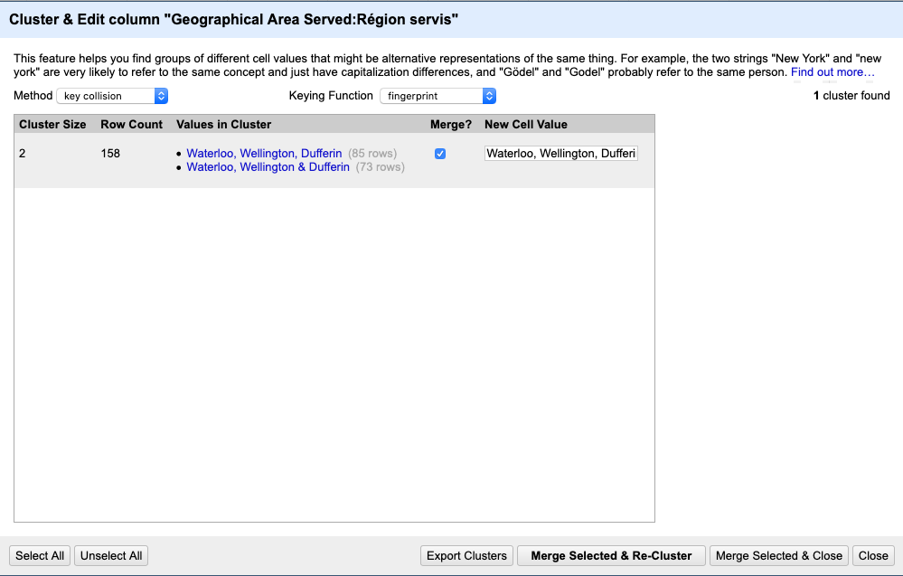
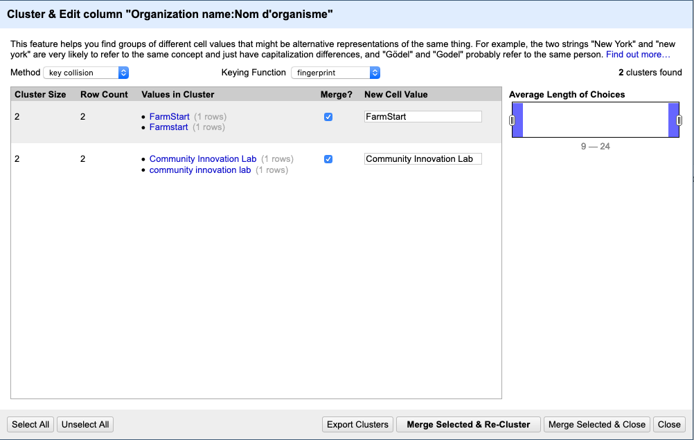

# Ontario Trillium Foundation Grant Funding Analysis Methodology

Ontario Trillium Foundation (OTF) is the largest grant foundation in Canada, and as a foundation entirely dependent on Ontario government funding,it is an instrument of government policy through granting priorities in the social economy.
One of Ontario Trillium Foundations goals is to encourage best practices in the social economy in Ontario.
One of these best practices is transparency, and the Ontario Trillium Foundations transparency initiatives has been publication of its grants information as Open Data [Ontario Trillium Foundation Open Data](https://otf.ca/open).
The OTF grant datasets provide a comprehensive view of funding through the foundation to social economy organizations serving individuals with disabilities in Ontario.

## Research Questions answerable through the OTF Datasets

### Primary Research Question

1) Is there a difference between grants for organizations serving **individuals with disabilities**, and other grants, for the following parameters:
* Number of grants
* Dollar value of grants
* Number of organizations

## Secondary Research Question

2) Do the datasets allow for intersectional analysis, e.g. grants supporting both disability and race?

## Tertiary Research Question

3) Do the available fields in the database e.g. Recipient Org:Charitable Registration Number allow combination with other datasets such as Revenue Canada’s T3010 database for analysis?

**Source of files**

The downloadable OTF data sets were retrieved from: [Ontario Trillium Foundation Open Data](https://otf.ca/open) on June 26, 2020.
There is an OTF Data Inventory which provides a list of all the datasets available from the same website
Filename: otf_data_inventory_en

Revenue Canada T3010 data is another dataset that requires more attention from social scientists, particularly social scientists researching charities in Canada and more broadly social economy organizations.
Note that Revenue Canadas T3010 database is published as a searchable data base available to the public at: [Government of Canada - List of Charities - basic search](https://apps.cra-arc.gc.ca/ebci/hacc/srch/pub/dsplyBscSrch).
In this document, a set of files available on request from Revenue Canada was utilized rather than the search pages.  The matching of data completed here is much more efficiently accomplished using the data files.
The Revenue Canada T3010 data file was published 17 July 2020, and subsequently received through postal mail in the subsequent week.
Revenue Canada T3010 data is not _required_ for the majority  of analysis completed here, and is not required to answer the primary and secondary research questions.
Revenue Canada T3010 data is required to answer the tertiary question, proving it can be done here, and not the focus of effort.

### Files available for analysis from OTF as of September 6, 2020

The following files are available for to answer the research question and subquestions:

* Grants for the period between 2015 to 2020
  * Filename: otf_granting_data_since_april_1_2015
  * 3,105 grants (rows) of data
* Youth Opportunities Fund Grants for the period between 2013 to 2020
  * Filename: OTF_yof-granting-data
  * 240 grants (rows) of data
* Grants for the period between 1999 to 2015
  * Filename: otf_granting_data_fiscal_year_2000-2015_20150717
  * 22,686 grants (rows) of data
* Cities in Ontario matched to an OTF catchment area.
  * Filename: otf_catchment_area-cities_concordance_file
  * 1129 cities (rows) of data
  * o	The OTF catchment area is a geographical area in the province of Ontario that roughly corresponded to historical Local Health Integration Networks (LHINs)
* (Statistics Canada) Census Divisions in Ontario matched to an OTF catchment area.
 * Filename: otf_catchment_area-census_division_concordance_file
 * 21 Census Divisions (rows) of data

The most relevant OTF files for analysis to be completed for here are:

1. otf_granting_data_since_april_1_2015
2. OTF_yof-granting-data
3. otf_granting_data_fiscal_year_2000-2015_20150717

### Files provided for analysis from Revenue Canada as of 31 July 2020

* T3010_2017ONBasicContactInfo
* T3010_2017ONDirectors
* T3010_2017ONFinancialInfo
* T3010_2017ONGeneralInfo
* T3010_2017ONNewOngoingPrograms
* T3010_2017ONSchedule1
* T3010_2017ONSchedule2
* T3010_2017ONSchedule3
* T3010_2017ONSchedule5
* T3010_2017ONSchedule7PADescription
* T3010_2017ONSchedule7PAOutsideCanada
* T3010_2017ONSchedule7PAResources

The most relevant Revenue Canada files for analysis to be completed here are:
1. T3010_2017ONBasicContactInfo
2. T3010_2017ONFinancialInfo

All the Revenue Canada T3010 files are related to each other through the BN/Registration Number field.
Therefore in connecting any other datasets to the Revenue Canada T3010 set of files, the BN/Registration Number has to be accurate and match Revenue Canada format.

Some conventions:
* In the remainder of this document, the files are referenced by their filename e.g. name_of_file.xyz rather than a log form description
* In the remainder of this document, the English field names foreach field will be used for brevity, assuming that the French field names simply contain the same information, but in French.

**List of fields in each file as Appendices**
1.	The complete list of fields available in otf_granting_data_since_april_1_2015 are listed in Appendix B
2.	The complete list of fields available in OTF_yof-granting-data are listed in Appendix C
3.	The complete list of fields available in otf_granting_data_fiscal_year_2000-2015_20150717 are listed in Appendix D
4.	The complete list of fields available in: T3010_2017ONBasicContactInfo are listed in Appendix E
5.	The complete list of fields available in: T3010_2017ONFinancialInfo are listed in Appendix F

It is useful to note here that the fields available and content available in each field both enable and limit the analysis possible @williamsCrimeSensingBig2017.  For example where the “Population Served” field contains the content “Disability”, we can perform analysis on grants that can be separated out by this parameter.  On the other hand, if the “Population Served” field contains the content “Disability”, but the field does not include any other content e.g. “Intellectual Disability”, or “Developmental Disability”, then no further analysis can be performed on Intellectual or Developmental Disability. As we shall see, the different datasets available from OTF allow different types of analysis.

## Quality Issues and Detailed Methodology
OTF grant data is not perfect or ‘clean’ data.
There are missing fields, and incorrectly entered data.
But it is mostly complete and mostly accurate data, and in the absence of other sources of equivalent data, cleaning the dataset and filling in the missing values as much as possible is the best option.
The steps required to clean the dataset to a reasonable level of utility are outlined here. Although some of the steps may seem pedantic, applying Open Science methodology is similar to a physics, chemistry or biology science experiment, where the steps if rigorously reported in detail, can be replicated by other people to verify and validate the result.
One of the benefits of Open Data is the ability for multiple researchers to access to the same dataset and do different analyses, or do the same analyses to verify each others results @petersPROSPECTSOPENSCIENCE2013.
Social science researchers are notorious for not providing enough data or a detailed enough methodology that enables replication by others.
OTF will benefit from the investment it has already made in releasing its grant data as open data by more researchers using the data.
In some ways, reporting the detailed steps taken to clean up data in this thesis as a published and public document will encourage OTF to apply the same cleanup steps to upcoming releases for the dataset to make it cleaner and more accessible for all future researchers.
More broadly OTF’s objective of transparency in the social economy will be supported by demonstrating the type of analysis that can be done by researchers on OTF Grant Open Data.

# Methodology for otf_granting_data_since_april_1_2015

## Analyze the cleanest dataset first

The file otf_granting_data_since_april_1_2015 is the cleanest dataset, or the dataset with the least amount of effort required to transform it into a usable dataset since it is the most recent.
The reason the cleanest dataset is selected is that data cleanup processes are activities with diminishing returns.
If we can perform analysis with a lower level of cleanup, the dataset more valuable on the utility vs effort scale.
We can also take lessons learned from analyzing the cleanest dataset and apply them to datasets that require more effort for cleanup and analysis

## OpenRefine for data cleanup

OpenRefine is a free, Open Source tool available to everyone for data analysis at [OpenRefine](https://openrefine.org/).
Since OpenRefine is a tool specifically designed for cleaning up and analyzing data, it provides a number of powerful features.
For example the Facet feature allows easy clustering of data that is similar, where the data entered is slightly different, but belongs in the same group.
The same results are achievable using MS Excel and the Pivot Tables function but it takes more steps and therefore more time.   

**Why clustering within the same field is required**

Most of the differences between common descriptions are either errors in data entry, or a change in a common term is used in grant applications over time. As OPen Refine describes it "This feature helps you find groups of different cell values that might be alternative representations of the same thing. For example, the two strings "New York" and "new york" are very likely to refer to the same concept and just have capitalization differences, and "Gödel" and "Godel" probably refer to the same person."
For example, the following terms mean the same thing for the purposes of analysis here:
1.	People with disabilities
2.	Individuals with disabilities
And therefore when counting the number of records, we need to be able to count all records with both these term together, in other words “cluster” them together.

e.g. In the following step in OpenRefine Facet clustering in the field Geographical Area Served clusters together records with “Waterloo, Wellington, Dufferin” with “Waterloo, Wellington, & Dufferin”  so that all records are updated to “Waterloo, Wellington, Dufferin”.

*Figure 1: Clustering data using Open Refine in Field Geographical Area Served*

e.g. In the following step in OpenRefine Facet clustering in the field Organizational Name clusters together records with content “FarmStart” with records with content “Farmstart”  so that all records are updated to “FarmStart”.  Through the same dialog OpenRefine Facet clustering in the field Organizational Name clusters together records with content “Community Innovation Lab” with records with content “community innovation lab” so that all records are updated to “Community Innovation Lab”.  Therefore OpenRefine clustering can be used to cluster multiple similar records together during the same step.

*Figure 2: Clustering data using Open Refine in Field Organization Name*

Clustering of similar records should be completed with caution, so that differences that are relevant for analysis are not lost through clustering.  Since this thesis is focused on people with disabilities, therefore some of the other nuances in data can be reduced.

##Data cleanup effort vs. utility##

All fields in each data set do not require an equivalent level of data cleanup effort.  In some cases, the fields are already “clean” and do not require any further cleanup in the form of clustering or transformations. For example, in the file otf_granting_data_since_april_1_2015, the fields Fiscal Year and Grant Programme do not appear to have any obvious errors, and therefore do not require further cleanup.  

In other cases the entire field contains either erroneous or unusable data. For example, in the file otf_granting_data_since_april_1_2015, the last column or field contains error values including formulas such as “=AC609-SUM(#REF!,#REF!)”, which is probably some artifact of an internal process, that was not removed when publishing the dataset.  This field was deleted in its entirety to ensure it does not confound any further analysis.

In still other cases the field contains data that is not valuable for the purpose of the analysis to be completed.  For example in the file otf_granting_data_since_april_1_2015, the field Funding Org has the same value across all records: “Ontario Trillium Foundation”. Similarly, the field Country Served: has the same value across all records: “Canada”.  These fields can easily be excluded from any further analysis.

Finally, the fields that are used in further analysis can be classified further classification by level of effort to be invested in cleanup.  For example, in the file otf_granting_data_since_april_1_2015, the following fields require different levels of cleanup effort:
•	Organization name
•	Recipient Org:Incorporation Number
•	Recipient Org:Charitable Registration Number
Organization Name typically contains many data entry errors, so a **low** level of effort was invested in cleaning up the Organization Name field (clusters only).
Other identifying fields including Incorporation Number and Charitable Registration Number will be used to differentiate organizations, in the context of this thesis which is focused on social economy organizations.
Recipient Org:Incorporation Number is a useful identifier for linking to other business related data, but no additional linked data analysis is planned for this thesis using this field, and therefore, a **medium** level of effort was invested in cleaning up the Recipient Org:Incorporation Number field (clusters and transformations).
Recipient Org:Charitable Registration Number is an important field as a unique identifier for linking to Revenue Canada T3010 charity data.
As previously mentioned, valuable healthcare research involving individuals with intellectual and developmental disabilities has been conducted using linked data (Arim, et. al. 2019; Shooshtari, 2017).
Since some linked data analysis is planned as a tertiary question as part of this thesis, a **high** level of effort was invested in cleaning up the Recipient Org:Charitable Registration Number field (clusters and transformations and manual edits).
A note of caution, that aiming for perfection or no errors is often not an attainable without unlimited time and other resources.
Therefore there is a level of “cleanliness” or “error-freeness which is adequate for analysis.
For example, for the Recipient Org:Charitable Registration Number field, a 95% clean or 5% detectable error rate was targeted.
The detailed steps for cleanup of the Recipient Org:Charitable Registration Number field is provided in the appendix of JSON outputs from OpenRefine, where the steps were captured. [Appendix G](ontario-trillium-foundation-grants/JSON-OpenRefine-cleaning-steps-OTF-since-2015.md)

### Fields not used for further analysis

Data in all fields used for analysis need to be cleaned up.
Therefore, to minimize unnecessary cleanup effort it is useful to identify fields which will not be used for further analysis.  The following fields are mostly common across all grants, so they are not included for further analysis
* Funding Org: commonly “Ontario Trillium Foundation”
* Country Served: commonly “Canada”

The following are internal OTF administrative data such as a unique identifier for each grant, that is not for the purposes of this analysis
* Identifier
* Organization name
* Submission date
* Approval date
* Cross-catchment indicator
* Geographical Area Served
* Recipient Org:City
* Recipient Org:Postal Code
* Co-Application
* Rescinded/Recovered
* Rescinded/Recovered Initiated By
* Amount Rescinded/Recovered
* Last modified

One might think “Organization name” is an important field in determining for example the number of grants received per organization.
Since organization names are prone to data entry errors, the more exact Recipient Org:Incorporation Number and Recipient Org:Charitable Registration Number are used for organization level analysis.
Therefore more cleanup time was invested into the fields Org:Incorporation Number and Recipient Org:Charitable Registration Number, than into Organization Name.

Similarly, one might think Postal code is a useful field e.g. the United Way report, Poverty by Postal Code: The geography of neighbourhood poverty (https://www.unitedwaygt.org/research-and-reports), was a seminal report.
But in this case, the postal code provided in the file otf_granting_data_since_april_1_2015 is the **head office** of the grant recipient organization.
Geographical area served better indicator, but it is a wide area based on LHINs, which is too broad a geographical area for analysis.

### Fields used for further analysis
In the file otf_granting_data_since_april_1_2015:¬
The primary field including data to determine if the grant is related to **disability** is:
* Population Served

Grants where the Population Served was “People with Disabilities” was analyzed for differences in the following fields.  
* Fiscal Year
* Grant Programme
* Amount Applied For
* Amount Awarded
* Planned Dates:Duration (months)
* Description (English)
* Program Area
* Budget Fund
* Age Group
* Recipient Org:Incorporation Number
* Recipient Org:Charitable Registration Number

Cleanup Steps Requiring Judgement

Cleanup decisions are always a matter of judgement by the researcher.
As previously explained , for the field Recipient Org:Charitable Registration Number field, a 95% clean or 5% detectable error rate was targeted.
In this subsection an additional area of judgement is required. The cleanup for Population Served and Age Group field for example required some judgement in combining similar classifications.

e.g. Using OpenRefine Facet clustering in the field Population Served: records using “Diverse Cultural Communities and Racial Groups” were combined with records using “Diverse Cultural Communities”, and for the purpose of analysis the description “Diverse Cultural Communities and Racial Groups” was used.

e.g. Using OpenRefine Facet clustering in the field Population Served: records using “LGBTQIA” were combined with records using “LGBTQ+”, and for the purpose of analysis the description “LGBTQIA” was used.

e.g. Using OpenRefine Facet clustering in the field Population Served: records using “Indigenous or Aboriginal” were combined with records using “Indigenous”, records using “Aboriginal” and for the purpose of analysis the description “Indigenous or Aboriginal” was used.

In the Age Group field, after initial clustering, there were a number of grants covering two Age Groups.
As the following table demonstrates, there are only six grants out of 3105 that served two age groups, but its useful to separate them out to allow cleaner analysis.

_Table 2: Number Of Grants Serving Two Age Groups_

| Age Group 1                         | Age Group 2   | Number of Grants |
|-------------------------------------|---------------|------------------|
| Adults (25-64)                      |               | 4                |
| Adults                              | Seniors (65+) | 1                |
| Children up to 12 years             |               | 368              |
| Children up to 12 years             | Youth         | 4                |
| General population (all age groups) |               | 1457             |
| Seniors (65+)                       |               | 212              |
| Youth                               |               | 640              |
| Youth                               | Seniors (65+) | 1                |
| (blank)                             |               | 1                |

_Table 2: Number Of Grants By Population Served And Fiscal Year_

| Population Served                                  | 2015-2016 | 2016-2017 | 2017-2018 | 2018-2019 | 2019-2020 | Grand Total |
|----------------------------------------------------|-----------|-----------|-----------|-----------|-----------|-------------|
| Diverse Cultural Communities and Racialized Groups | 76        | 91        | 80        | 87        | 85        | 419         |
| Francophones                                       | 29        | 10        | 19        | 18        | 13        | 89          |
| General Populations                                | 390       | 400       | 321       | 345       | 362       | 1818        |
| Indigenous or Aboriginal                           | 29        | 28        | 37        | 20        | 31        | 145         |
| LGBTTQIA                                           | 2         | 10        | 12        | 9         | 6         | 39          |
| People with Disabilities                           | 99        | 100       | 89        | 84        | 83        | 455         |
| Senior                                             | 1         |           |           |           |           | 1           |
| Women                                              | 33        | 26        | 27        | 23        | 22        | 131         |
| Grand Total                                        | 659       | 665       | 585       | 586       | 602       | 3097        |

_Table 3: Number Of Grants By Population Served And Grant Programme_

| Population Served                                  | Community Investments | Ontario150 Community Capital Program | Strategic Investments | Grand Total |
|----------------------------------------------------|-----------------------|--------------------------------------|-----------------------|-------------|
| Diverse Cultural Communities and Racialized Groups | 399                   | 12                                   | 8                     | 419         |
| Francophones                                       | 88                    | 1                                    |                       | 89          |
| General Populations                                | 1625                  | 137                                  | 56                    | 1818        |
| Indigenous or Aboriginal                           | 137                   | 4                                    | 4                     | 145         |
| LGBTTQIA                                           | 37                    | 1                                    | 1                     | 39          |
| People with Disabilities                           | 404                   | 46                                   | 5                     | 455         |
| Senior                                             |                       |                                      | 1                     | 1           |
| Women                                              | 128                   | 3                                    |                       | 131         |
| Grand Total                                        | 2818                  | 204                                  | 75                    | 3097        |

_Table 4: Average of Amount Applied For per Grant By Population Served and Fiscal Year_

| Population Served                         | 2015-2016 | 2016-2017 | 2017-2018 | 2018-2019 | 2019-2020 | Grand Total |
|----------------------------------------------------|-----------|-----------|-----------|-----------|-----------|-------------|
| Diverse Cultural Communities and Racialized Groups | 237,541   | 200,853   | 169,005   | 225,395   | 203,041   | 206,967     |
| Francophones                                       | 123,072   | 81,080    | 224,505   | 185,544   | 157,446   | 157,664     |
| General Populations                                | 144,200   | 132,029   | 157,505   | 141,643   | 160,225   | 146,577     |
| Indigenous or Aboriginal                           | 130,452   | 180,114   | 135,568   | 228,525   | 183,361   | 166,186     |
| LGBTTQIA                                           | 71,850    | 295,350   | 194,958   | 150,022   | 351,867   | 228,156     |
| People with Disabilities                           | 150,614   | 155,250   | 203,875   | 141,876   | 151,713   | 160,638     |
| Senior                                             | 10,000    |           |           |           |           | 10,000      |
| Women                                              | 154,839   | 190,646   | 212,804   | 191,574   | 186,695   | 185,692     |
| (blank)                                            |           | 62,563    |           |           |           | 62,563      |
| Grand Total                                        | 154,503   | 149,894   | 170,241   | 160,513   | 169,106   | 160,435     |

_Table 5: Average of Amount Awarded per Grant By Population Served and Fiscal Year_

| Population Served                             | 2015-2016 | 2016-2017 | 2017-2018 | 2018-2019 | 2019-2020 | Grand Total |
|----------------------------------------------------|-----------|-----------|-----------|-----------|-----------|-------------|
| Diverse Cultural Communities and Racialized Groups | 237,541   | 200,853   | 169,005   | 225,395   | 203,041   | 206,967     |
| Francophones                                       | 123,072   | 81,080    | 224,505   | 185,544   | 157,446   | 157,664     |
| General Populations                                | 144,200   | 131,892   | 157,505   | 141,643   | 160,225   | 146,547     |
| Indigenous or Aboriginal                           | 130,452   | 180,114   | 135,568   | 228,525   | 183,361   | 166,186     |
| LGBTTQIA                                           | 71,850    | 295,350   | 194,958   | 150,022   | 351,867   | 228,156     |
| People with Disabilities                           | 150,614   | 155,250   | 203,875   | 141,876   | 151,713   | 160,638     |
| Senior                                             | 10,000    |           |           |           |           | 10,000      |
| Women                                              | 154,839   | 190,646   | 212,804   | 191,574   | 186,695   | 185,692     |
| (blank)                                            |           | 56,938    |           |           |           | 56,938      |
| Grand Total                                        | 154,503   | 149,746   | 170,241   | 160,513   | 169,106   | 160,403     |

_Table 6: Average of Planned Dates:Duration By Population Served And Fiscal Year_

| Population Served                          | 2015-2016 | 2016-2017 | 2017-2018 | 2018-2019 | 2019-2020 | Grand Total |
|----------------------------------------------------|-----------|-----------|-----------|-----------|-----------|-------------|
| Diverse Cultural Communities and Racialized Groups | 21.72     | 19.31     | 18.90     | 20.16     | 20.44     | 20.07       |
| Francophones                                       | 17.03     | 14.90     | 21.37     | 15.67     | 17.08     | 17.45       |
| General Populations                                | 15.86     | 14.18     | 15.45     | 14.46     | 16.50     | 15.28       |
| Indigenous or Aboriginal                           | 14.24     | 16.68     | 13.81     | 16.65     | 14.23     | 14.93       |
| LGBTTQIA                                           | 11.50     | 21.80     | 16.00     | 16.44     | 24.00     | 18.59       |
| People with Disabilities                           | 17.07     | 14.34     | 18.17     | 14.08     | 16.24     | 15.98       |
| Senior                                             | 12.00     |           |           |           |           | 12.00       |
| Women                                              | 20.12     | 19.96     | 21.59     | 18.74     | 21.05     | 20.31       |
| (blank)                                            |           | 12.75     |           |           |           | 12.75       |
| Grand Total                                        | 16.89     | 15.33     | 16.72     | 15.56     | 17.15     | 16.32

_Table 7: Population Served By Program Area_

| Population Served                                  | Active People | Connected People | Green People | Inspired People | Promising Young People | Prosperous People | (blank) | Grand Total |
|----------------------------------------------------|---------------|------------------|--------------|-----------------|------------------------|-------------------|---------|-------------|
| Diverse Cultural Communities and Racialized Groups | 30            | 113              | 15           | 77              | 118                    | 65                | 1       | 419         |
| Francophones                                       | 12            | 22               | 1            | 30              | 15                     | 9                 |         | 89          |
| General Populations                                | 460           | 230              | 265          | 381             | 224                    | 250               | 8       | 1818        |
| Indigenous or Aboriginal                           | 8             | 31               | 7            | 44              | 31                     | 24                |         | 145         |
| LGBTTQIA                                           |               | 18               |              | 3               | 13                     | 5                 |         | 39          |
| People with Disabilities                           | 103           | 186              |              | 43              | 66                     | 57                |         | 455         |
| Senior                                             |               | 1                |              |                 |                        |                   |         | 1           |
| Women                                              | 9             | 36               |              | 6               | 19                     | 61                |         | 131         |
| Grand Total                                        | 622           | 637              | 288          | 584             | 486                    | 471               | 9       | 3097        |

_Table 8: Population Served by Budget Fund_

| Population Served                                  | Capital | Collective Impact | Grow | Ontario150 | Provincial Impact | Seed | Grand Total |
|----------------------------------------------------|---------|-------------------|------|------------|-------------------|------|-------------|
| Diverse Cultural Communities and Racialized Groups | 56      | 8                 | 163  | 12         | 4                 | 176  | 419         |
| Francophones                                       | 22      |                   | 24   | 1          | 3                 | 39   | 89          |
| General Populations                                | 613     | 56                | 433  | 137        | 18                | 561  | 1818        |
| Indigenous or Aboriginal                           | 31      | 4                 | 31   | 4          | 1                 | 74   | 145         |
| LGBTTQIA                                           | 4       | 1                 | 13   | 1          |                   | 20   | 39          |
| People with Disabilities                           | 134     | 5                 | 114  | 46         | 4                 | 152  | 455         |
| Senior                                             |         | 1                 |      |            |                   |      | 1           |
| Women                                              | 15      |                   | 53   | 3          | 3                 | 57   | 131         |
| Grand Total                                        | 875     | 75                | 831  | 204        | 33                | 1079 | 3097        |

_Table 9: Grants by Age Group and Population Served_

| Population Served                                  | Children up to 12 years | Children up to 12 years;Youth | Youth | Adults (25-64) | Adults; Seniors (65+) | General population (all age groups) | Seniors (+65) | (blank) | Grand Total |
|----------------------------------------------------|-------------------------|-------------------------------|-------|----------------|-----------------------|-------------------------------------|---------------|---------|-------------|
| Diverse Cultural Communities and Racialized Groups | 65                      |                               | 134   | 67             |                       | 118                                 | 35            |         | 419         |
| Francophones                                       | 16                      |                               | 27    | 8              |                       | 28                                  | 10            |         | 89          |
| General Populations                                | 223                     | 2                             | 316   | 149            |                       | 1030                                | 97            | 1       | 1818        |
| Indigenous or Aboriginal                           | 14                      | 1                             | 36    | 12             |                       | 82                                  |               |         | 145         |
| LGBTTQIA                                           | 1                       |                               | 22    | 5              |                       | 9                                   | 2             |         | 39          |
| People with Disabilities                           | 42                      | 1                             | 78    | 118            | 1                     | 153                                 | 62            |         | 455         |
